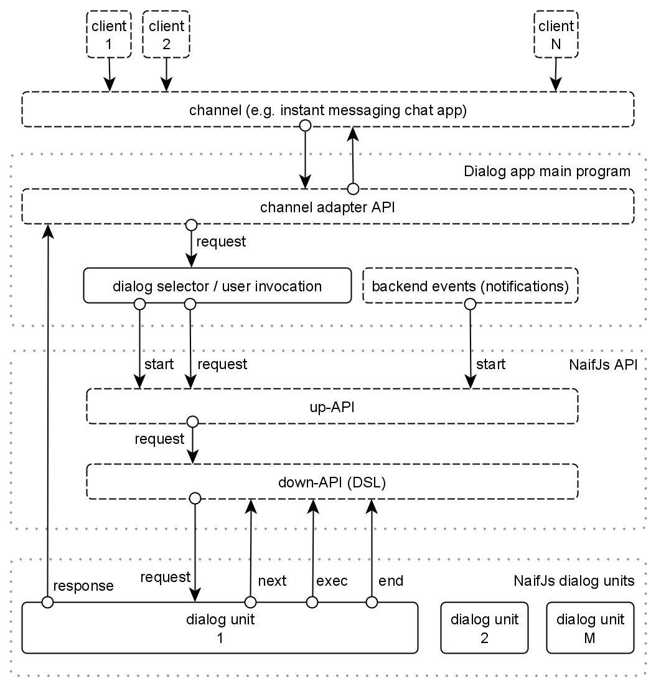
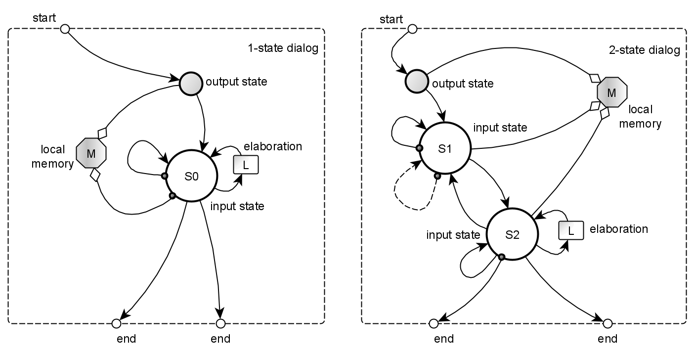
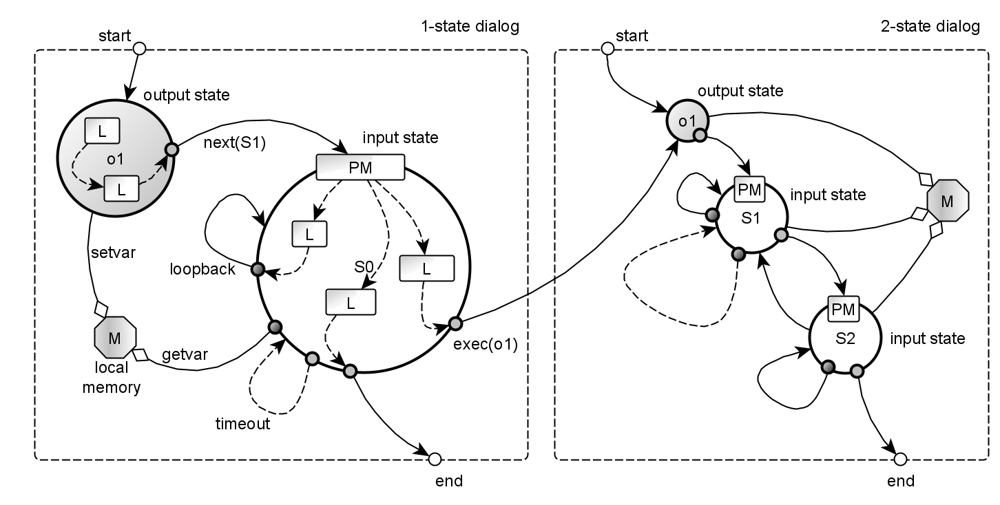
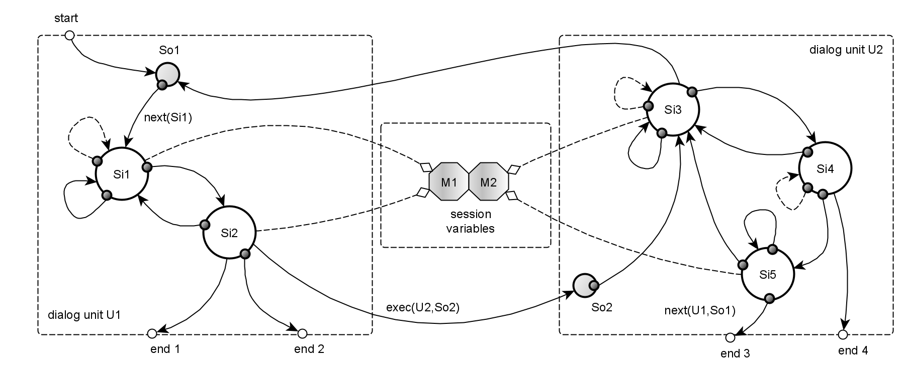

# NaifJs Concepts

- Dialog system
  - [Stateful multi-turn dialogues](#stateful-multi-turn-dialogues)
  - [Architecture](#architecture)

- State-machine based dialog manager 
  - [Dialogue as a state-machine](dialogue-as-a-state-machine)
  - [State tracker](#state-tracker)

- What is a dialog unit?
  - [Dialog Unit](#dialog-unit)
  - [Coding a dialogue with a javascript domain specific language](#coding-a-dialogue-with-a-javascript-domain-specific-language)
  - [Requests and responses](#requests-and-responses)

- Whats is an Application?
  - [Dialog application](#dialog-application)
  - [Sessions](#dialog-application)


## Stateful multi-turn dialogues

A dialogue is an exchange of words between two or more people, speaking a natural language. 

In a human-computer interaction context, dialogue takes place between two systems: 
the user (A) and a computer program B, usually called *chatbot* or *conversational agent* 
(I prefer to say *dialog system*, or *conversational application*).

Consider this simple turn-taking:

> A > what time is it?<br>
> B < it's half past seven.<br>

It's a dialogue? 
In a broad sense yes, but it's a special case of conversation because it finish after just a single back and forth exchange.
I call *0-state dialogue* this *single-turn* scenario, because the conversation is apparently *stateless*. 

So I prefer to define as dialogue a *multi-turn* *stateful* turn-taking between two systems.

> A > Is it expected to rain today?<br>
> B < There’s no rain today, there’s sunshine and the temperature is 18 degrees centigrade.<br>
>
> A > Well, how about tomorrow?<br>
> B < It will rain tomorrow.<br>

In the exchange of sequences here above, 
the topic of the conversation concerns the weather forecast. 

The initial question of system A (the user) brings system B (the chatbot) to an *internal state*, 
which maintains the topic of discussion, 
so that the subsequent user request is understood in the specific context "weather forecast". 
This is an example of elementary multi-turn conversation (I call *state-1*).

It is therefore possible to model more complex dialog as  a finite state machine,
where two interacting systems (for example A is a human being and B is a chatbot), 
evolve into successive conversational states.


## Architecture

The general architecture of a dialog system based on NaifJs is shown in figure 1. 

|  |
|:--:|
| figure 1: Dialogue system architecture, using NaifJs |

We consider a multiuser scenario where many users can interact the dialogue system. 
The main software components are:

- The channel 

  It's where users interact. 
  It could be by example an instant messaging platform, a group chat platform, an email client, etc. 

- The channel adapter API

  The outside interface component of the main program is the channel API 
  that allow to send and receive messages to the channel. 

  ASR/TTS (speech transcript / text-to-speech) sub-modules
  could be part of this component if messages include voice processing.
  A message containing different types of multimodal data is an inbound `request` to the dialog system. 
  Backwards, dialog system outbound `response` message is translated by the adapter following the specific message data types.

  > A multi-channel application is realized with a dialog system backend 
  > that's able to manage more than one channel in parallel. 

- The dialog selection/activation 
 
  NaifJs is built on the idea that user interacts with the dialog system activating, one at a time, a dialog flow, 
  I call *dialog unit* (or *dialog thread*), each one implemented as a dedicated state machine. 

  >  A dialog unit could be considered as a micro-skill or workflow to accomplish some application task.

  There are two distinct kind of events that trigger a new dialog: 

  - *Pull events* (user sentence invocation)

    The core logic of the main application program must contain a dialog selector 
    that activates (`start`) a corresponding dialog unit (*pull mode*). 
    A common case is that a dialog unit is triggered when a specific *invocation sentence* that user input, 
    is matched by the dialog selector module (a sort of main node).

  - *Push events* (backend logic trigger)

    Another way to activate the dialogue is an event generated by some backend logic.
    It's common to push user with notification-based conversations, 
    maybe following agent-initiative-based logic, 
    by example events generated by some cron-based logic (*pull mode*).
 
- The dialogue manager
 
  The NaifJs dialog manager passes inbound channel requests to underlying dialog units, 
  is in charge to schedule a track the internal state of a dialog 
  and at least send outbound responses to the channel adapter.
 
- The application dialogues

  An application (or project) is made by a set of (standalone or interconnected) *dialog units*,
  "self-consistent" finite state machines (FSM), 
  single *units* of conversational logic that accomplish some specific application workflows.

 
## Dialog as a state-machine

NaifJs is a dialog manager that implements dialog management 
modeling a conversation as a finite state machine 
([FSM](https://en.wikipedia.org/wiki/Finite-state_machine)).

A conversation in NaifJs can be thought of as traversing the state machine's nodes, 
to be considered as a graph of *states*.

### State representation

Each *node* (or *state*) of the graph has an associated unique identifier (*stateid*), 
a string label identifying both the state machine (the dialog unit) 
and the specific state inside the dialog unit):

```
const stateid = 'myDialogueUnit.myState'
``` 

Where:

- `myDialogueUnit` is the name of the state machine 
  (corresponding to a unique dialogue unit file: `myDialogueUnit.js`)
- `myState` is the name of the javascript function handler `myState()`

### Input and output states

In each state machine there are two different kind of nodes:

- *input state*
 
  It's a *wait node* of "understanding" and local processing of input requests (user *utterances*). 
  The inbound user sentence is matched with some kind of [pattern matching](patternmatching.md) 
  (e.g. Regular Expressions) and each matched *intent* triggers an *action* (any backend logic). 
  Lastly, a response message is feed back to user. 
  See nodes *S1* and *S2* in figure 2.
  The input state is triggered with `next('myDialogueUnit.myInputState')` DSL.

- *output state* 
 
  It's an execution node that makes some backend elaboration and produce a message/prompt (response) to the user. 
  The output state can be considered as the *action* part of previous described input state. 
  It's triggered with `exec('myDialogueUnit.myOutputputState')` DSL.


### Rule-based state transitions

Transitions between states take places for two kind of events:

- External events
 
  These are the `start` of the state-machine and any successive `request`. 
 
  A dialogue is initially activated by a caller program (with `start` function) 
  that activate the initial state. 

  Usually (but not perforce) the first node is an output state.
  The node performs some kind of logic (L, in figure 2), usually (but non perforce) 
  feedback a `response` to the user and can store contextual (shared) memory variables (M). 
  The response to the user is any kind of message 
  (can be a text, a voice message, an image or audio/video content).

- Internal events

  Transitions between any successive internal node is decided by programmer, 
  that explicitly move 

  - to the target output state with `exec` function
  - to the target input state  with `next` function
 
> 👉 State transitions are deterministic and "rule-based", 
> being programmed by developer, 
> in the action part of [pattern matching](patternmatching.md) rules. 

|  |
|:--:|
| figure 2: at the left a *1-state* *dialogue unit*, containing an *output state*, an *input state*, a local memory. At the right a *2-state* dialogue unit, containing 2 input states, an input state, a local memory. |


## State tracker

The engine is just a *conversation state* scheduler/tracker. 

As soon a dialogue state machine is activated from a main program (acting as a *main state*), 
the NaifJs engine track the conversation state (*stateid*) and schedule next state.

The incoming user request event (the user utterance as text), run a state handler function.

```javascript
// dialog manager set a specific state-machine state
naif.start('dialogueUnit.dialogueState')

// when user talk to the agent:
naif.request(user, utterance)
```

To progress the dialogue flow, the initial (output) state usually send some reply to the user 
and activates a subsequent input state (using `next` DSL function), 
in which the dialogue manager analyzes the user's response (a sentence in natural language)
and performs a contextual interpretation based on a [pattern matching](patternmatching.md) (PM). 

> The dialogue manager is agnostic with respect
> to the NLU mechanism and for simplicity and efficiency
> the parsing has been implemented with the use of regular expressions (regexp). 

In the case of a positive pattern match, 
the input node performs some processing and a response is given to the user.
The response could be textual, a synthetic voice speech or other multimedia audio/video content. 

The current state can evolve into a successive input state (using `next` API), 
a successive output state (using `exec` API) or might not change 
(*loopback*, see the dotted lines in figure 3),
based on a dialog flow programmed by the designer. 

The dialog flow finally ends, when developer terminate the conversation, 
terminating the state machine (with `end` API).

|  |
|:--:|
| figure 3: at the left, the *1-state* dialogue unit, where the input state is detailed. |


## Dialog Unit

To complete a specific task (a workflow), 
a multi-turn conversation is implemented as a network of micro-dialogues, 
called *dialogue units*, each containing a graph of nodes that completes a *contextual* 
(related to in a specific domain and task) conversation workflow. 

A dialog unit is a finite state machine (FSM), 
a single *unit* of conversational logic allowing accomplish any specific application workflow.

From developer point of view, each dialogue unit is a standalone file, 
exporting a module that implement a single state machine, or micro-dialogue, 
that has an entry point (the initial state) and one or more ends.

> These dialog units modules could be concatenated each other, resulting a complex dialogue. 
> Each dialogue unit can receive input parameters, following a sort of functional programming model. 

|  |
|:--:|
| figure 4: a more complex state machine, made by 2 interconnected dialogue units. |


### Session variables

Each dialogue unit has a *short-term memory* made by persistent variables 
with local scope to the unit itself, but shared among all dialog units part of the same application.
👉 More details in [variables](variables.md) and [sessions](session.md) docs.


### Writing a dialogue with a javascript DSL

To write a *dialogue unit* in NaifJs, the developer just write vanilla javascript code, 
added by NaifJs internal [domain specific language (DSL)](API.md#down-dialogue-api) functions
that define how input and output states (nodes) of the state machine are interconnected.

Each state machine correspond to a dialog unit, an unique javascript module file 
containing a list of functions (handlers) for each *input state*, 
and *output state* of the designed state machine.


### Requests and responses

NaifJs is a backend dialog manager engine, multi-user, channel agnostic, message agnostic. 

The dialog engine interacts with the external system, receiving and sending messages. 
The platform is pretty agnostic regarding media contents in `request` and `response` messages. 
👉 Read more [here](requestresponse.md).


### Simple example of a dialog unit

Suppose we want to implement a simple dialogue unit 
that ask the user his name, and terminates. 

As soon the dialogue is activated (with `naif.start('getUserName.askName')`), 
the output state `askName` handler is triggered. 
The output state simply prompt the user and goto the input state with `next(getName)`.
Note that `say` and `ask` are specialized versions of generic `response` DSL.

> The example dialogue is a 1-state, 
> because it contains just a single input state handler (`getname`). 

Here below the basic code:

```javascript
// dialog unit file: getUserName.js
const getUserName = { askName, getName }
  
// output state 
function askName() {
  ask('Hello! What\'s your name?') 
  next('getUserName.askName')
}

// input state
function getName(sentence) {
  switch (take(sentence)) {

    // pattern 1: reply to greetings
    case match( /hi|hello|good morning|good afternoon/i ): 
      ask('Hi there! What\'s your name?')
      break
   
    // pattern 2: regexp rule to get a first name (e.g. Anna Lisa, Giorgio La Malfa)
    case match( /^(my name is |name me |i\'m )?(?<firstName>[A-Z][a-z]{1,}(\\s[A-Z][a-z]{1,})*)/i ): 
      say(`Nice to meet you, ${slots().firstName}?`)
      end()
      break
     
    // fallback
    default: 
      say( 'I do not understand.' )
      ask( 'What is your name?' )
      break
  }
}

module.exports = getUserName 
```


## [Dialog application](application.md)

In NaifJs, a *dialogue application*, or *project* is a set of dialogue units files, 
currently contained in a single specified directory, implementing all workflows of a specific application. See:

- 👉 [An application example (Telegram Bot)](application.md#an-application-example--Telegram-Bot-)
- 👉 [Sessions](sessions.md)
- 👉 [Project examples](../examples/README.md)


---

[top](#) | [home](../README.md) | [index](index.md)
