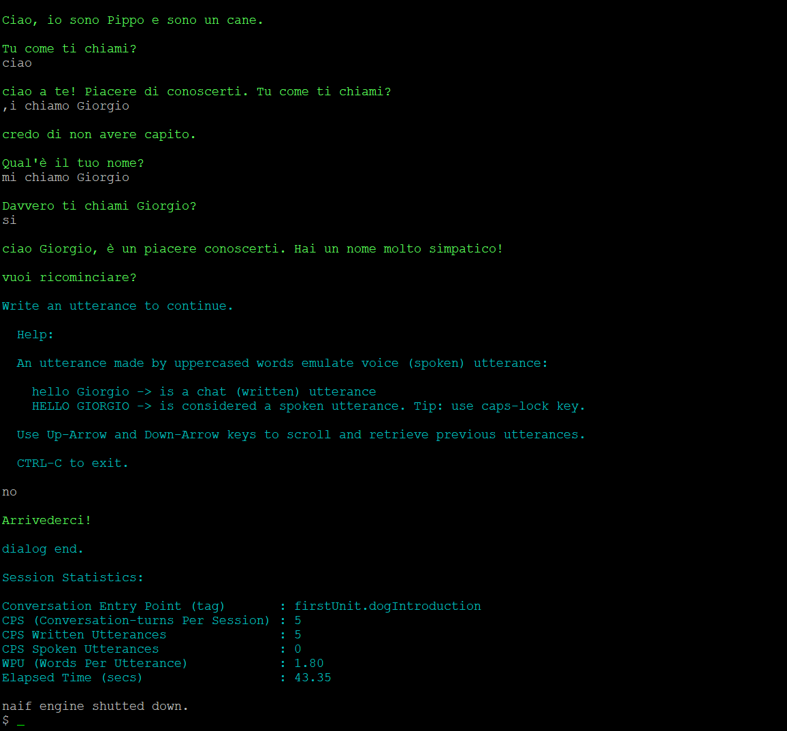

# `naif shell` 

 ⚠️  To be completed.


Command line dialog tester

```
$ naif shell
 _   _       _  __     _
| \ | |     (_)/ _|   | |
|  \| | __ _ _| |_    | |___
| . ` |/ _` | |  _|   | / __|
| |\  | (_| | | || |__| \__ \
|_| \_|\__,_|_|_| \____/|___/

NaifJs, simple state-machine based dialog manager
version: 0.46.1, author: giorgio.robino@gmail.com

Command line dialog tester

Usage:

    naif shell
    naif test shell

    --dir=<directory path>
      Dialog units directory path

    --start=<unit.state>
      Initial dialog stateid in format "unit.state"

    [--id=<id>]
       session id. Optional argument

    [--logfile=<path/filename>]
       Log filename with directory path

    [--sessionsfile=<path/filename>]
       Sessions filename with directory path

    [--silent -s]
       Silent mode. Just dialog

Examples:

   naif test --start=firstUnit.start --dir=examples/myDialogs

   naif test --dir=examples/app \
             --start=anotherUnit.showContents \
             --id=123456 \
             --logfile=examples/app/dialogs.log \
             --sessionsfile=examples/app/sessions.json
```


|  |
|:--:|
| figure 1: `naif test --dir=examples/story_it --start=firstUnit.dogIntroduction`.  |


---

[top](#) | [home](../README.md) | [index](index.md)
